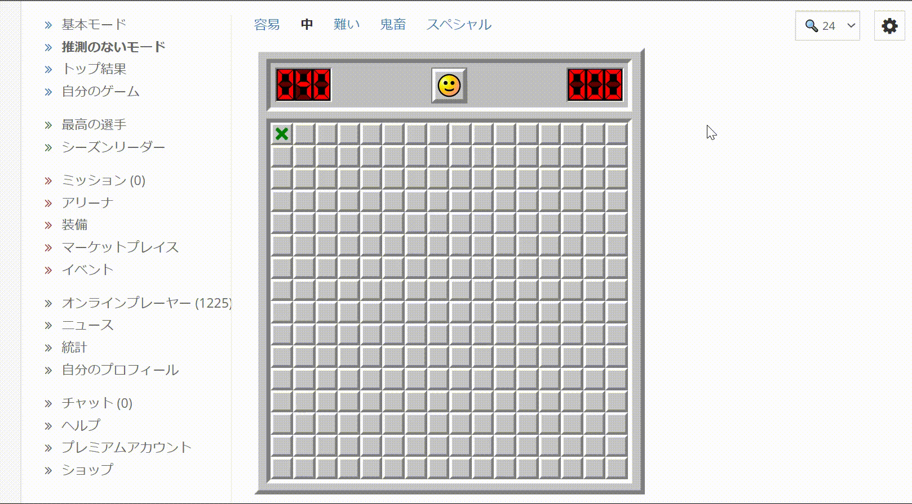
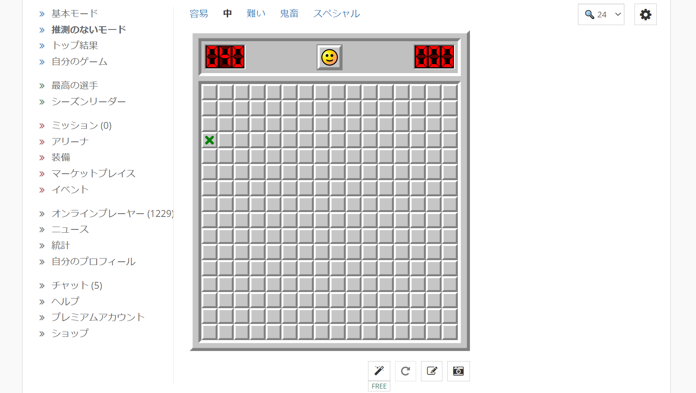
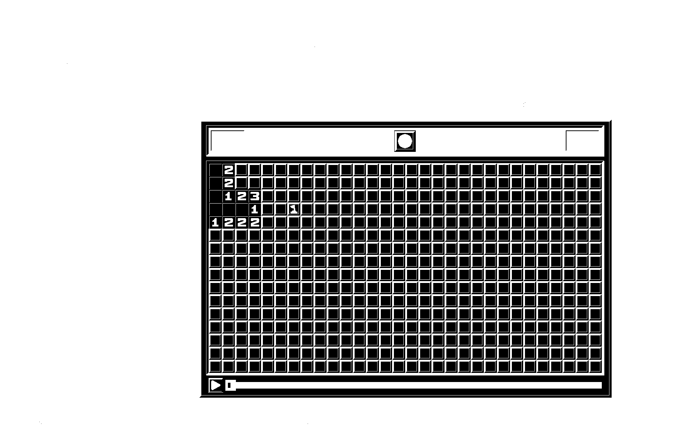
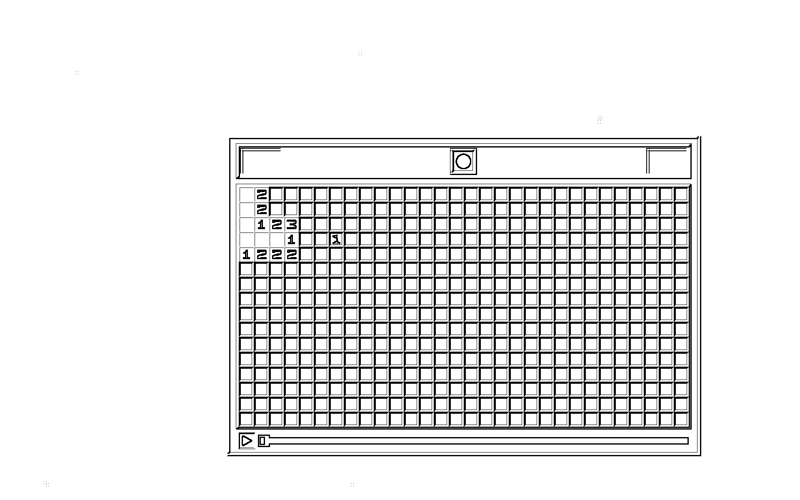
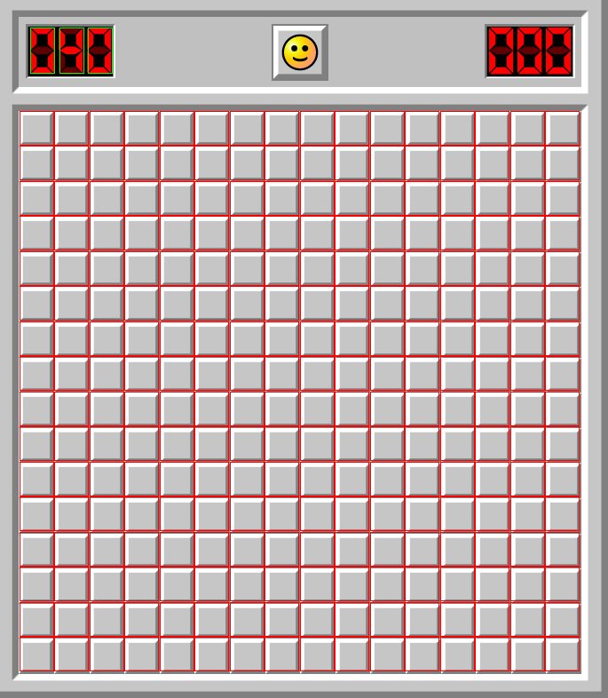

# AutoMinesweeperSolver
**悪用禁止！** 
マインスイーパを自動で解きます。 
クリックも自動で行います。 

# 使い方
1. [Minesweeper Online](https://minesweeper.online/ja/)を開きます。
2. 基本モードまたは推測のないモードを開きます。(中級程度推奨)
3. 盤面全体が画面に映るように調整します。
4. プログラムを実行します。

解くことが出来た場合や手詰まりになった場合は終了します。

Qキーを押すと強制終了します。

毎回必ず問題が解けるわけではありません。

# 実行方法
実行には2つの方法があります。
## ① Pythonによる実行
実行にはPython3がインストールされている必要があります。
### 必要なモジュールのインストール
`pip install -r requirements.txt`
### 実行
`python MinesweeperSolver.py`
## ② exeファイルによる実行
Windowsでなければ実行できません。
### 実行
`run.bat`

# 処理の過程イメージ

